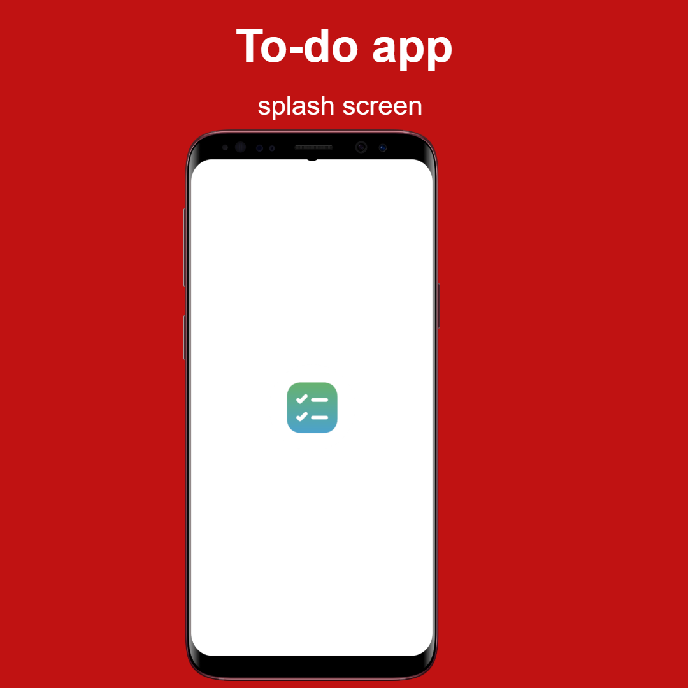
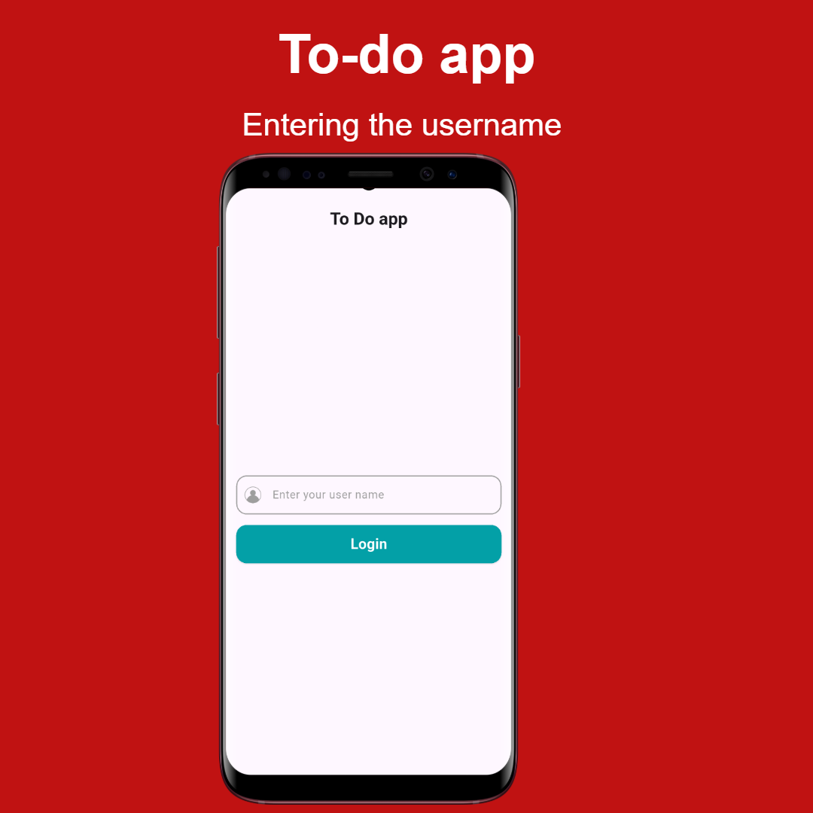
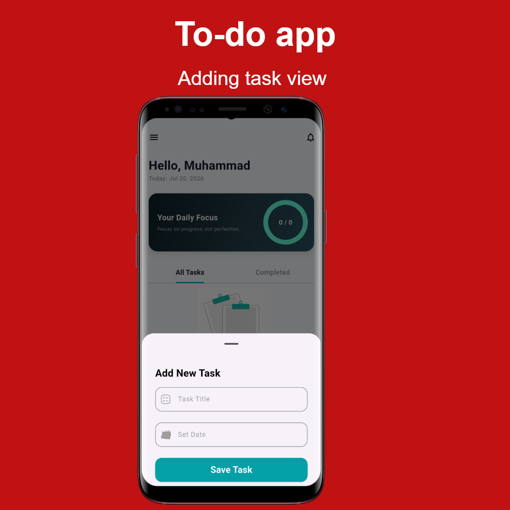
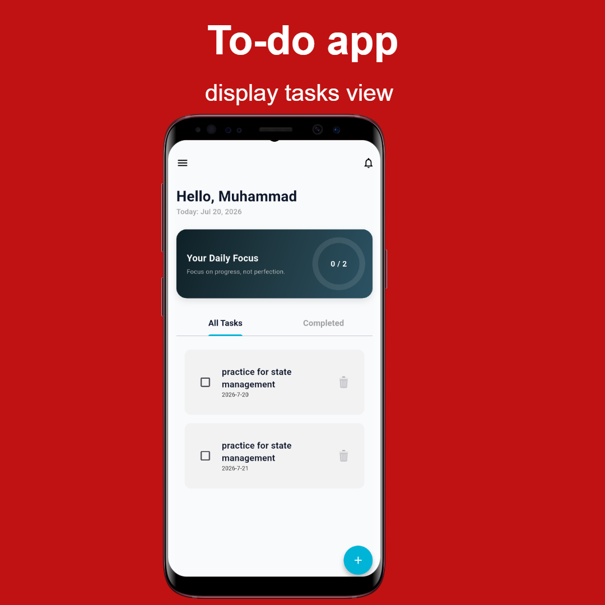
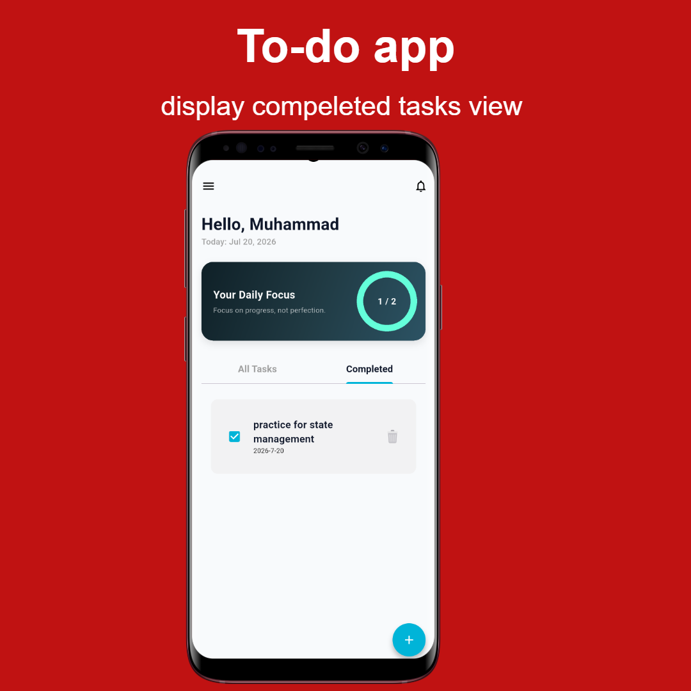
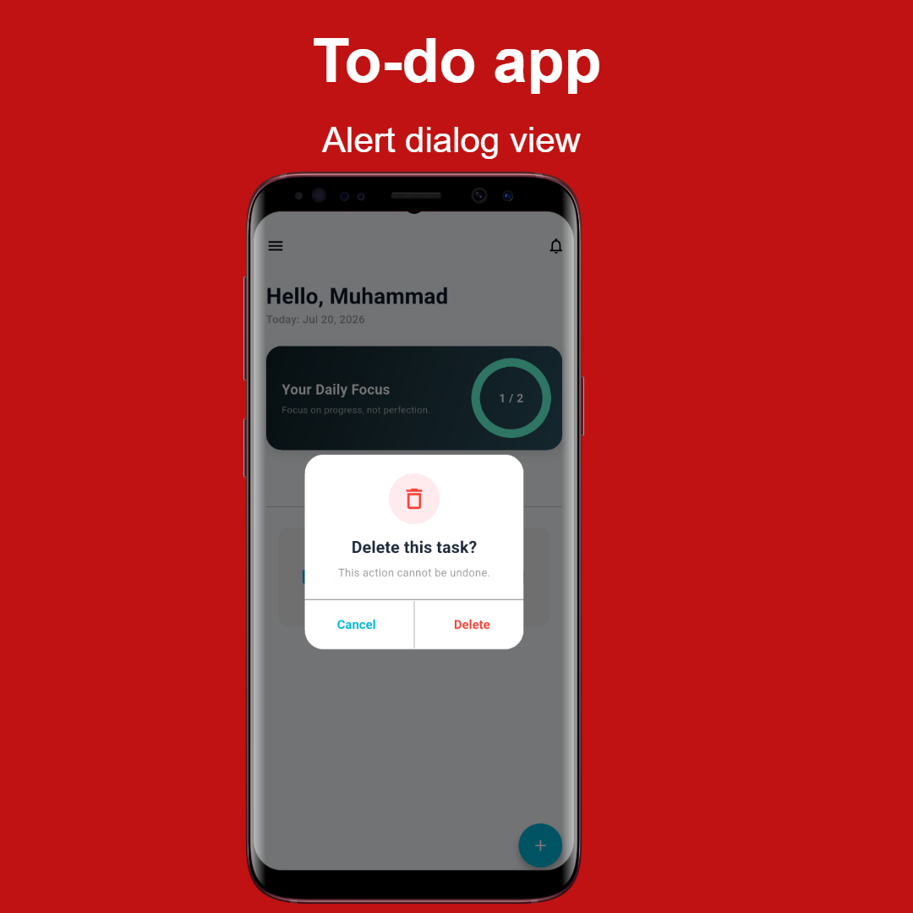

<div align="center">

# 📝 TaskFlow - Flutter To-Do App

A modern Flutter To-Do application built with **Bloc/Cubit State Management**, featuring task management, user authentication, clean UI, and responsive design.


</div>

---

# ✨ Features

### 🔐 User Authentication

- User Login
- User Registration
- Form Validation
- Password Confirmation
- User State Management using Cubit

---

### ✅ Task Management

- Add New Task
- Delete Task
- Mark Task as Completed
- Display Active Tasks
- Display Completed Tasks
- Empty Tasks State
- Confirmation Dialog before Deleting
- Bottom Sheet for Creating Tasks

---

### 🎨 Modern UI

- Material Design 3
- Responsive Layout
- Reusable Widgets
- Custom Buttons
- Custom TextFields
- Beautiful Dialogs
- Smooth Navigation

---

### 🏗 Clean Architecture Principles

Project organized into multiple layers:

```
lib
│
├── cubits
│   ├── task_cubit
│   └── user_cubit
│
├── models
│
├── views
│
├── widgets
│
└── main.dart
```

---
# 📱 Application Screens

## Splash Screen

<p align="center">
  
</p>

---

## Main Flow

<p align="center">
  
  &nbsp;&nbsp;&nbsp;
  
</p>

<p align="center">
  <b>Enter Username</b>
  &nbsp;&nbsp;&nbsp;&nbsp;&nbsp;&nbsp;&nbsp;&nbsp;&nbsp;&nbsp;&nbsp;&nbsp;&nbsp;&nbsp;&nbsp;&nbsp;&nbsp;&nbsp;&nbsp;&nbsp;&nbsp;&nbsp;&nbsp;&nbsp;
  <b>Home Screen</b>
</p>

---

## Task Management

<p align="center">
  
  &nbsp;&nbsp;&nbsp;
  
</p>

<p align="center">
  <b>Add Task</b>
  &nbsp;&nbsp;&nbsp;&nbsp;&nbsp;&nbsp;&nbsp;&nbsp;&nbsp;&nbsp;&nbsp;&nbsp;&nbsp;&nbsp;&nbsp;&nbsp;&nbsp;&nbsp;&nbsp;&nbsp;&nbsp;&nbsp;&nbsp;&nbsp;&nbsp;&nbsp;&nbsp;&nbsp;&nbsp;
  <b>All Tasks</b>
</p>

---

## Task Status

<p align="center">
  
  &nbsp;&nbsp;&nbsp;
  
</p>

<p align="center">
  <b>Completed Tasks</b>
  &nbsp;&nbsp;&nbsp;&nbsp;&nbsp;&nbsp;&nbsp;&nbsp;&nbsp;&nbsp;&nbsp;&nbsp;&nbsp;&nbsp;&nbsp;&nbsp;&nbsp;&nbsp;
  <b>Delete Task</b>
</p>

---

## Alert Dialogs

<p align="center">
  
  &nbsp;&nbsp;
  
  &nbsp;&nbsp;
  
</p>

<p align="center">
  <b>Add Task</b>
  &nbsp;&nbsp;&nbsp;&nbsp;&nbsp;&nbsp;&nbsp;&nbsp;&nbsp;&nbsp;
  <b>Delete Confirmation</b>
  &nbsp;&nbsp;&nbsp;&nbsp;&nbsp;&nbsp;&nbsp;&nbsp;&nbsp;&nbsp;
  <b>Task Deleted</b>
</p>

---
# 🛠 Tech Stack

### Framework

- Flutter

### Language

- Dart

### State Management

- Bloc
- Cubit

### Architecture

- Feature-based Structure
- Separation of Concerns
- Reusable Components

---

# 📂 Project Structure

```
lib
│
├── cubits
│   ├── task_cubit
│   │      ├── tasks_cubit.dart
│   │      └── tasks_states.dart
│   │
│   └── user_cubit
│          ├── user_cubit.dart
│          └── user_states.dart
│
├── models
│      └── task_model.dart
│
├── views
│      ├── login_view.dart
│      ├── home_view.dart
│      └── completed_tasks_view.dart
│
├── widgets
│      ├── add_task_widget.dart
│      ├── alert_dialog.dart
│      ├── custom_button.dart
│      ├── custom_text_field.dart
│      ├── no_tasks_widget.dart
│      └── task_builder.dart
│
└── main.dart
```

---

# 🚀 Getting Started

Clone the repository

```bash
git clone https://github.com/Muhammadkhiry/todo_app.git
```

Install dependencies

```bash
flutter pub get
```

Run the application

```bash
flutter run
```

---

# 📌 Future Improvements

- Firebase Authentication
- Cloud Firestore
- Local Notifications
- Dark Mode
- Task Categories
- Task Priority
- Due Dates
- Search Tasks
- Filter Tasks
- Edit Existing Tasks
- Drag & Drop Reordering
- Animations

---

# 👨‍💻 Author

**Muhammad Khairy**

Computer and Systems Engineering Student

Flutter Developer

- GitHub: https://github.com/Muhammadkhiry
- LinkedIn: https://www.linkedin.com/in/muhammad-khairy/

---

<div align="center">

### ⭐ If you like this project, don't forget to Star the repository.

</div>